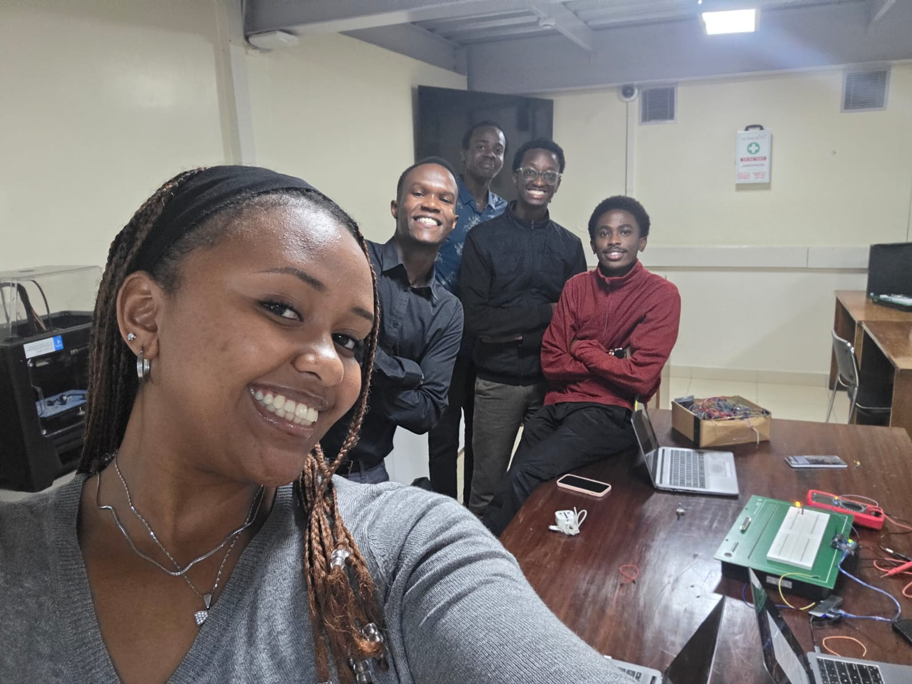
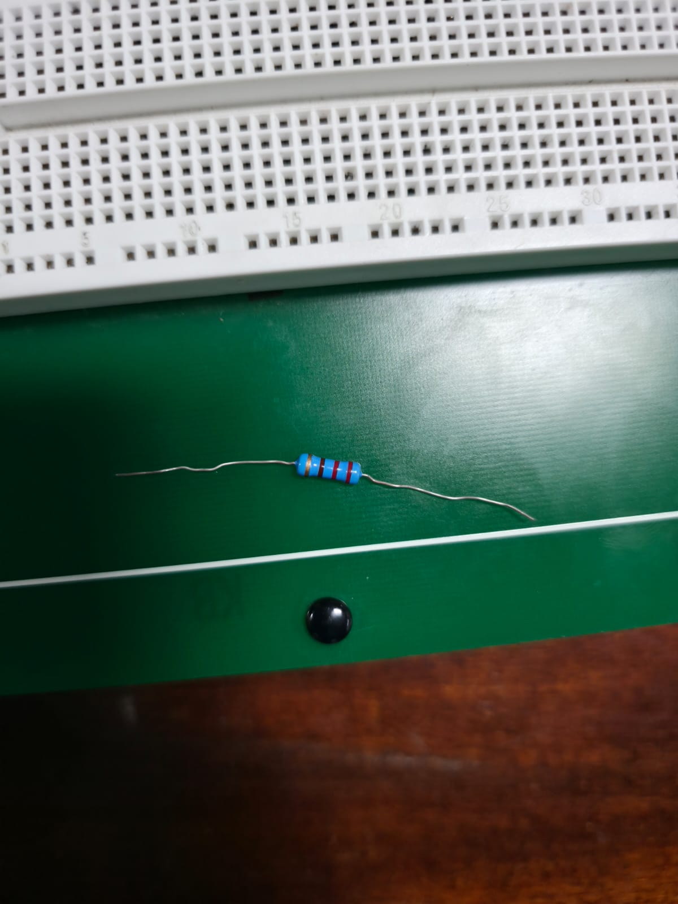
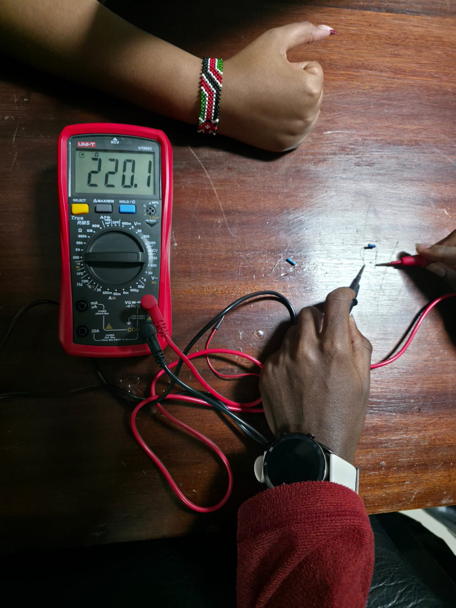
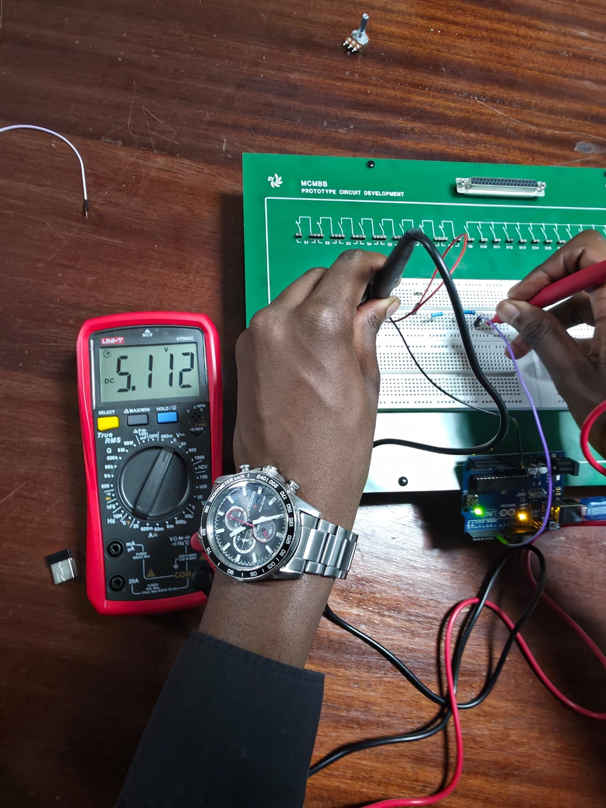
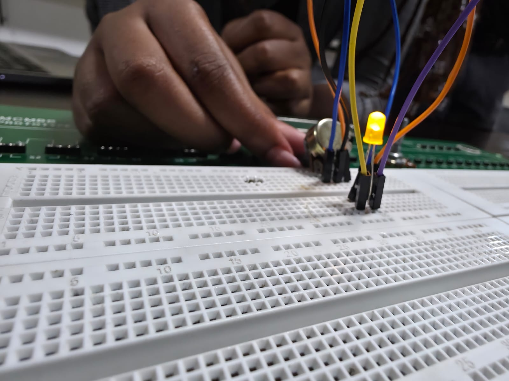
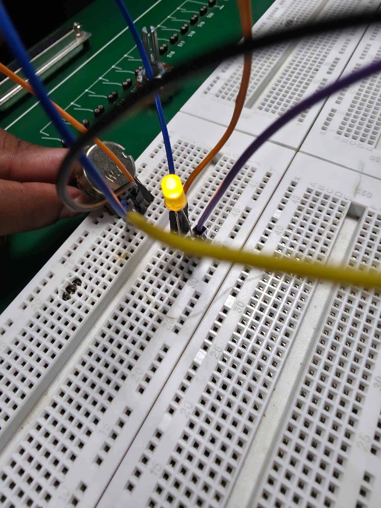
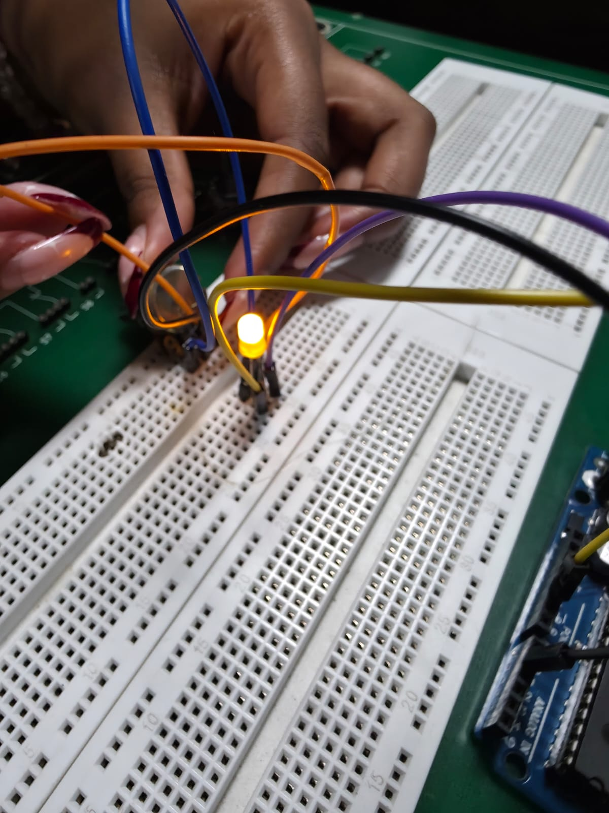
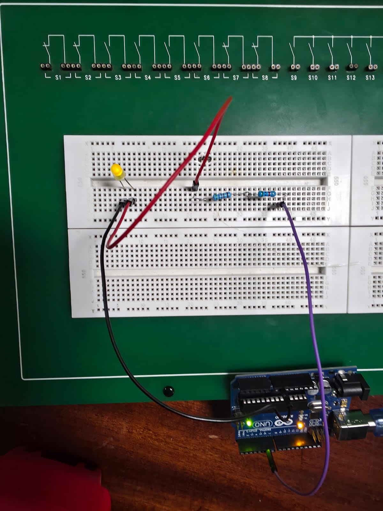
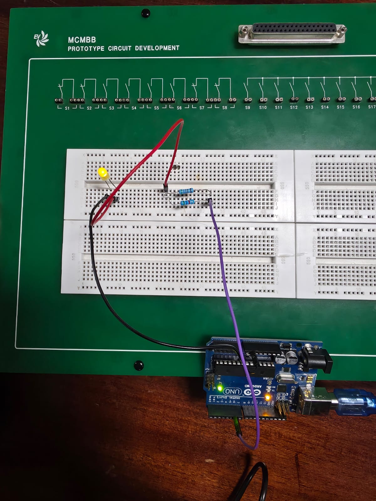

# ICS 4111: Practical Exercise 3 — Embedded Design
## Objective: Practical Demonstration of Ohm’s Law

This repository contains the documentation, schematic implementations, and findings for Practical Exercise 3, focusing on the practical application of Ohm's Law using an Arduino microcontroller, breadboard, resistors, LEDs, and a multimeter.

---

## 👥 Team Evidence
> **Submission Requirement:** 50% of the final score relies on teamwork validation. Below is the evidence of our group collaboration.

### Group Members 
| Student Name | Student ID |
| :--- | :--- |
| Waruhiu Jeremy Kang'ethe| 166263 |
| Deborah Rehana| 168656 | 
| Murega Kelvin Mutwiri| 166914 | 
| Muthii Eric Macharia| 166390 | 
| Andrew Karanja Gathirwa| 167144 | 
---

## 🔬 Experiment 1: Resistor Value Verification

### 1. Color Code Identification
* **Selected Resistor Bands:** Gold, Brown, Red, Orange
* **Determined Resistance Value (Nominal):** `___220____ Ω`

### 2. Multimeter Measurement
* **Measured Resistance Value:** `_____220.1__ Ω`

### 📊 Summary Table
| Method | Resistance Value (Ω) |
| :--- | :--- |
| **Nominal (Color Code)** | `__220__ Ω` |
| **Measured (Multimeter)** | `__220.1__ Ω` |

---

## 💡 Experiment 2: LED Circuit & Pulse Width Modulation (PWM)

### 1. Basic Circuit Schematic & Implementation
The Blink program was deployed using the Arduino IDE to control the LED circuit.

* **Measured Circuit Voltage:** `5.112V` (via Multimeter)

---

### 2. PWM Light Intensity Control (Potentiometer Integration)
A potentiometer was added to simulate Pulse Width Modulation (PWM) and control the LED brightness levels dynamically.

#### 📸 Circuit Brightness Levels
| 25% Brightness | 50% Brightness | 100% Brightness |
| :---: | :---: | :---: |
|  |  |  |
| *LED at 25% duty cycle* | *LED at 50% duty cycle* | *LED at 100% duty cycle* |

---

## 🔗 Experiment 3: Resistors in Series

### 1. Physical Implementation
The circuit was reconfigured to connect two resistors in a series configuration alongside the LED.

### 📊 Voltage Readings
* **Voltage Across Resistor 1 ($V_{R1}$):** `___5.4____ V`
* **Voltage Across Resistor 2 ($V_{R2}$):** `___5.4____ V`
* **Total Voltage Across Resistors ($V_{Total}$):** `___5.1____ V`

### 💬 Experiment Reflection
**Question:** Use Ohm’s Law ($I = V / R$) to estimate the current passed at each resistor.

> **Calculations:**
> * **Total Current:** `____0.5 __`
>

---

## ⚡ Experiment 4: Resistors in Parallel

### 1. Physical Implementation
The circuit was reconfigured to connect both resistors in a parallel configuration.

### 📊 Voltage Readings
* **Voltage Across Resistor 1 ($V_{R1}$):** `___5.1____ V`
* **Voltage Across Resistor 2 ($V_{R2}$):** `____5.1_ V`

### 💬 Experiment Reflection
**Question:** Use Ohm’s Law ($I = V / R$) to estimate the current passed at each resistor.

> **Calculations:**
> * **Current through circuit:** `___13.78__ A`

---